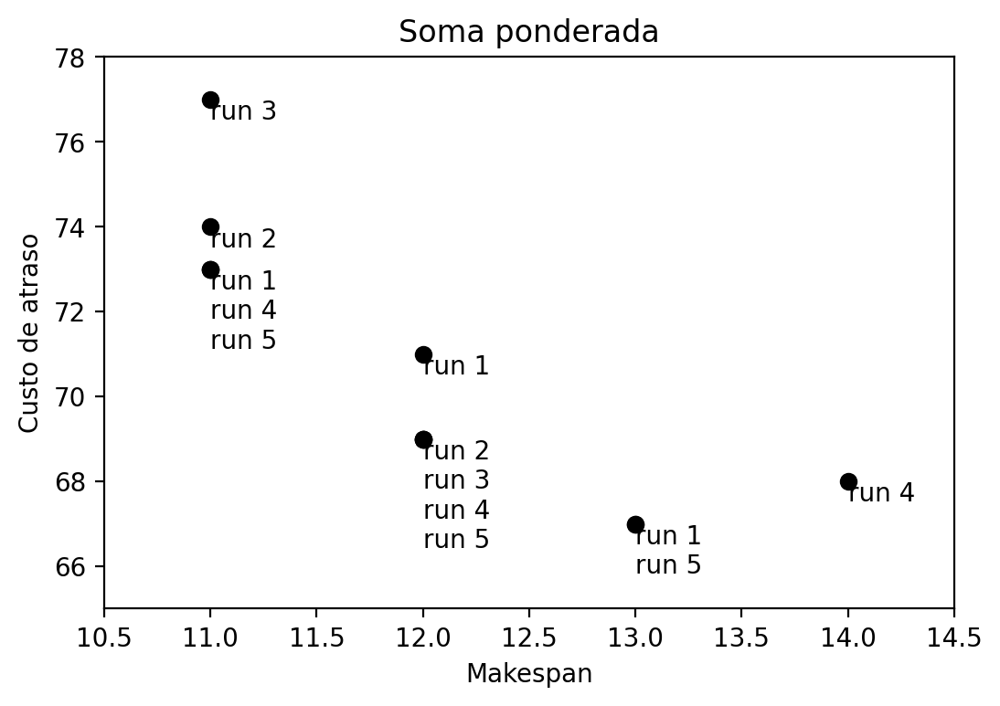

# teoria-da-decisao
Implementações de códigos baseados em teoria da decisão e soluções multiobjetivos.

Um exemplo de algumas execuções do algoritmo de soma ponderada usadas para alimentar os algoritmos de teoria da decisão podem ser encontrados abaixo.

